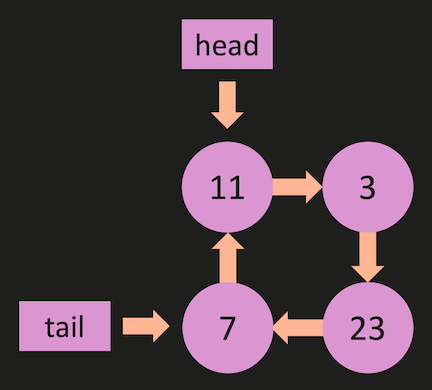
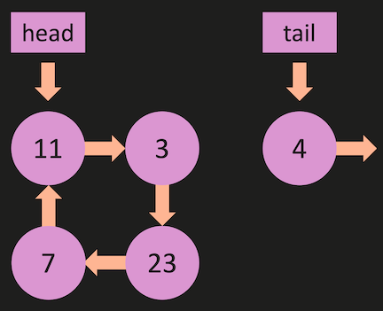
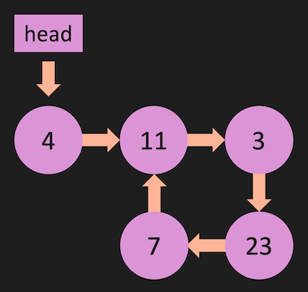

## LinkedList Interview Question

**1. LL: Find Middle Node ( ** Interview Question)**

Implement the `find_middle_node` method for the LinkedList class.

**Note: this `LinkedList` implementation does not have a `length `member variable.**

If the linked list has an even number of nodes, return the first node of the second half of the list.

Keep in mind the following requirements:

- The method should use a two-pointer approach, where one pointer (slow) moves one node at a time and the other pointer (fast) moves two nodes at a time.

- When the fast pointer reaches the end of the list or has no next node, the slow pointer should be at the middle node of the list.

- The method should return the middle node when the number of nodes is odd or the first node of the second half of the list if the list has an even number of nodes.

- The method should only traverse the linked list once.  In other words, you can only use one loop.

```python
class Node:
    def __init__(self, value):
        self.value = value
        self.next = None
        

class LinkedList:
    def __init__(self, value):
        new_node = Node(value)
        self.head = new_node
        self.tail = new_node

        
    def append(self, value):
        new_node = Node(value)
        if self.head == None:
            self.head = new_node
            self.tail = new_node
        else:
            self.tail.next = new_node
            self.tail = new_node
        return True
        

    # WRITE FIND_MIDDLE_NODE METHOD HERE #
    #                                    #
    #                                    #
    #                                    #
    #                                    #
    ###################################### 


my_linked_list = LinkedList(1)
my_linked_list.append(2)
my_linked_list.append(3)
my_linked_list.append(4)
my_linked_list.append(5)

print( my_linked_list.find_middle_node().value )


"""
    EXPECTED OUTPUT:
    ----------------
    3
    
"""

```


**Solution**  for LL: Find Middle Node *[here](./find_middle_node.md)*

_____________________________________________________
<br>

**2. LL: Has Loop ( \*\* Interview Question\*\*)**<br>
Write a method called `has_loop` that is part of the linked list class.

The method should be able to detect if there is a cycle or loop present in the linked list.

You are required to use Floyd's cycle-finding algorithm (also known as the "tortoise and the hare" algorithm) to detect the loop.

This algorithm uses two pointers: a slow pointer and a fast pointer. The slow pointer moves one step at a time, while the fast pointer moves two steps at a time. If there is a loop in the linked list, the two pointers will eventually meet at some point. If there is no loop, the fast pointer will reach the end of the list.

1. The method should follow these guidelines:
Create two pointers, slow and fast, both initially pointing to the head of the linked list.

2. Traverse the list with the slow pointer moving one step at a time, while the fast pointer moves two steps at a time.

3. If there is a loop in the list, the fast pointer will eventually meet the slow pointer. If this occurs, the method should return True.

4. If the fast pointer reaches the end of the list or encounters a None value, it means there is no loop in the list. In this case, the method should return False.

If your Linked List contains a loop, it indicates a flaw in its implementation. This situation can manifest in several ways:





```python
class Node:
    def __init__(self, value):
        self.value = value
        self.next = None
        
class LinkedList:
    def __init__(self, value):
        new_node = Node(value)
        self.head = new_node
        self.tail = new_node
        self.length = 1

    def append(self, value):
        new_node = Node(value)
        if self.length == 0:
            self.head = new_node
            self.tail = new_node
        else:
            self.tail.next = new_node
            self.tail = new_node
        self.length += 1
        return True

    # WRITE HAS_LOOP METHOD HERE #
    #                            #
    #                            #
    #                            #
    #                            #
    ##############################
    
    
    
    
my_linked_list_1 = LinkedList(1)
my_linked_list_1.append(2)
my_linked_list_1.append(3)
my_linked_list_1.append(4)
my_linked_list_1.tail.next = my_linked_list_1.head
print(my_linked_list_1.has_loop() ) # Returns True

```

**Solution**  for LL: Has Loop *[here](./Has_Loop.md)*