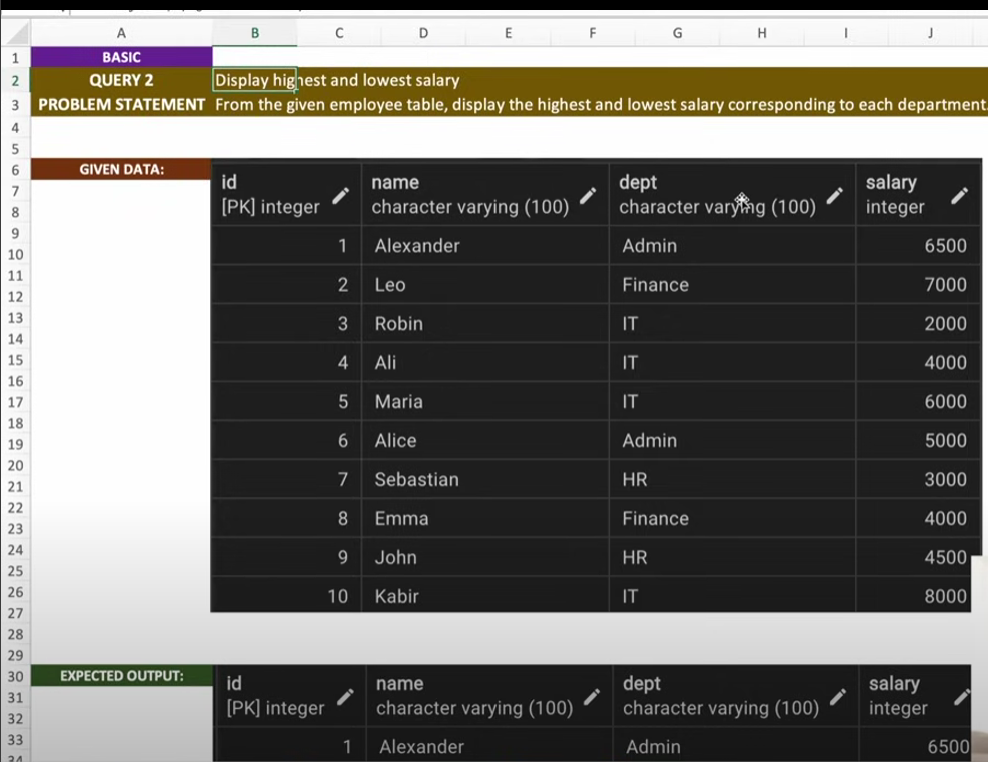
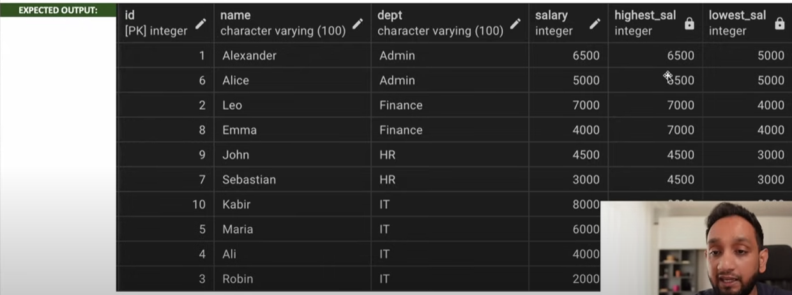

# LowestHighestSalary



```sql
select * from employee;

select * 
, max(salary) over ( partition by dept order by salary desc) as highest_salary
, min(salary) over ( partition by dept order by salary desc range between unbounded preceding and unbounded following ) as lowest_salary

from employee;
