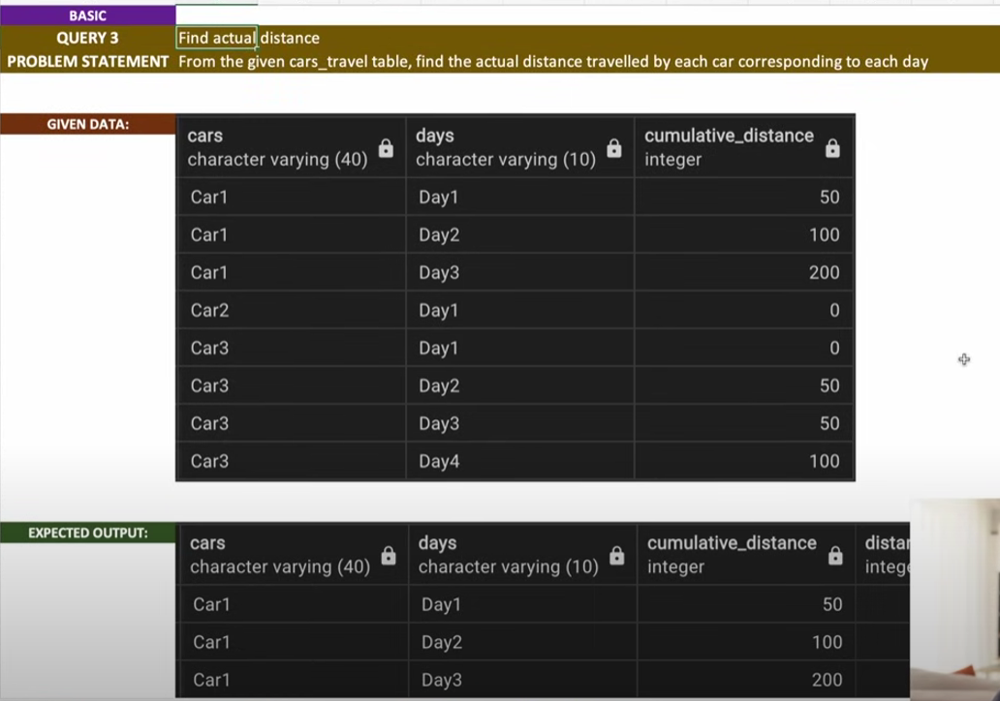
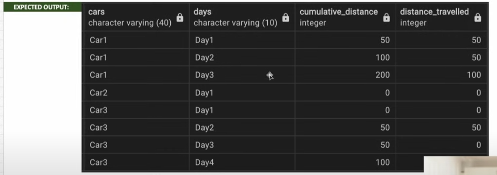

# FindActualDistance



```sql
select * from car_traversals;

--- Solution
select *
,cumulative_distance - lag(cumulative,1,0) over (partition by cars order by days) as distance 
from car_travels;

-- lag([col],[rolling_row],[default_value])