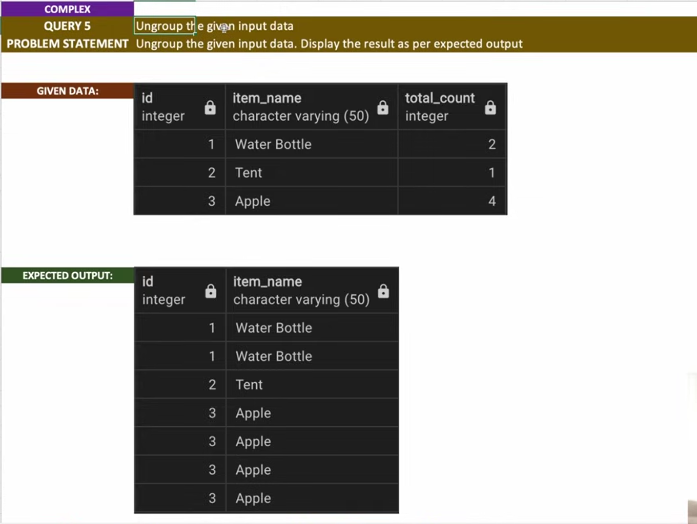

# Ungroup 


```sql
select * from travel_items;

with recursive cte as (
    select id, item_name , total_count, 1 as level
    from travel_items
    union all 
    select cte.id ,cte.item_name,cte.total_count - 1, level + 1 as level
    from cte 
    join travel_items t  on t.item_name = cte.item_name
                        and t.id = cte.id 
    where cte.total_count > 1 
)
select id, item_name ,level
from cte
order by 3 ;
